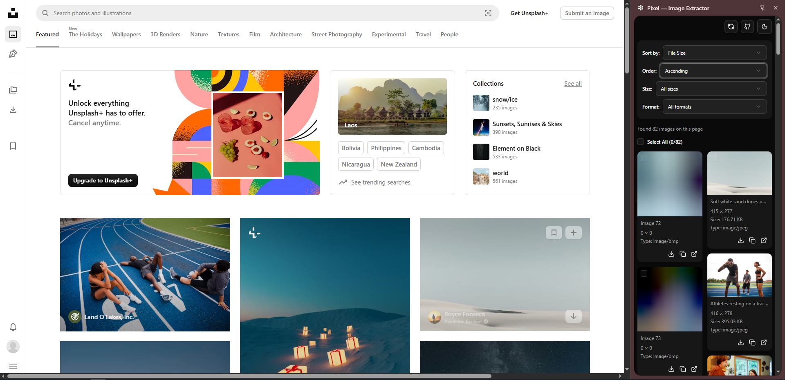

## Pixel — Image Extractor

Pixel — Image Extractor is a **high‑performance Chrome side panel extension** for **extracting, analyzing, sorting, and downloading images from any webpage**.  
It scans the current tab, collects images from multiple sources, and gives you powerful tools to organize and export them.



> Maintained by [`@lwshakib`](https://github.com/lwshakib)

---

### Features

- **Automatic image discovery**

  - Scans ``, `<picture>`, inline CSS background images, and SVG `<image>` elements.
  - Resolves relative URLs to absolute URLs and deduplicates repeated images.
  - Handles lazy‑loaded images and common `data-*` attributes used by modern sites.

- **Smart sorting**

  - Sort images by **file size**, **width**, **height**, **dimensions**, or **mimetype**.
  - Toggle **ascending / descending** order to surface the largest or smallest assets first.

- **Powerful filtering**

  - Filter by **size ranges** (e.g. small thumbnails vs. large hero images).
  - Filter by **file format / mimetype** (e.g. `image/jpeg`, `image/png`, `image/webp`, etc.).

- **Bulk actions**

  - Select multiple images at once.
  - **Download** selected images in bulk.
  - **Copy** all selected image URLs to the clipboard.
  - **Open** individual images in a new tab for inspection.

- **Modern UI / UX**
  - Clean side panel interface built with **React**, **shadcn/ui**, and **Radix UI**.
  - **Dark / light mode** toggle.
  - Loading skeletons and toast notifications for a smooth experience.

---

### How it works

When you open the Pixel side panel on any page:

1. The extension locates the **active browser tab**.
2. It tries to communicate with a **content script** to retrieve pre‑collected images.
3. If that is not available, it falls back to **injecting a script** that:
   - Walks the DOM and finds images in tags, CSS backgrounds, and SVGs.
   - Normalizes and deduplicates URLs.
4. The side panel then:
   - Displays all images in a responsive grid.
   - Enriches them with metadata (dimensions, mimetype, approximate size when available).
   - Lets you sort, filter, and act on the collection.

All processing happens in the **browser**, and the extension does **not** send your page content to any remote server.

---

### Installation

#### From source

1. Clone the repository:

```bash
git clone https://github.com/lwshakib/pixel-image-extractor.git
cd pixel-image-extractor
```

2. Install dependencies:

```bash
npm install
```

3. Build the extension:

```bash
npm run build
```

4. Open Chrome and navigate to `chrome://extensions/`.
5. Enable **Developer mode** (top right).
6. Click **Load unpacked** and select the generated `dist` directory.

#### Development mode

To work on the extension locally with Vite + CRXJS:

```bash
npm run dev
```

Follow the CRXJS dev instructions in your terminal to hook the dev build into Chrome while you iterate.

---

### Usage

1. Install and load the extension.
2. Visit any webpage that contains images (galleries, e‑commerce sites, blogs, dashboards, etc.).
3. Click the **Pixel — Image Extractor** extension icon to open the **side panel**.
4. Wait a moment while the extension scans the page.
5. Use:
   - The **Sort by** and **Order** controls to change how images are listed.
   - The **Size** and **Format** filters to focus on the assets you care about.
   - The **checkboxes** on each card to select one or more images.
6. Perform bulk actions:
   - **Download** the selected images.
   - **Copy URLs** of selected images to the clipboard.
   - **Open in new tab** to inspect a single asset.

---

### Project structure

- `src/sidepanel/` – Main React side panel app (UI, sorting, filtering, actions).
- `src/content/` – Content scripts used to interact with the page (if present).
- `src/background.ts` – Background service worker (handles extension icon click and side panel behavior).
- `manifest.config.ts` – Source manifest used by **@crxjs/vite-plugin** to generate the final `manifest.json`.
- `public/` – Static assets, including `demo.png` used in this README.

Build tooling:

- `vite.config.ts` – Vite + CRXJS configuration, React plugin, Tailwind integration, and automatic release zip bundling.
- `tsconfig*.json` – TypeScript project configuration for app and tooling.

---

### Scripts

Common `npm` scripts:

- `npm run dev` – Start the Vite development server with CRXJS.
- `npm run build` – Type‑check and build the extension into `dist/`.
- `npm run preview` – Preview the built app.

---

### Contributing

Contributions are very welcome!  
Please read **[CONTRIBUTING.md](./CONTRIBUTING.md)** for details on:

- Setting up the project locally
- Coding style and guidelines
- How to open issues and submit pull requests

All participation in this project is governed by the  
**[Code of Conduct](./CODE_OF_CONDUCT.md)**.

---

### License

This project is licensed under the **MIT License** – see **[LICENSE](./LICENSE)** for details.
